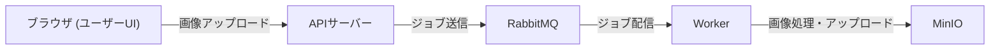
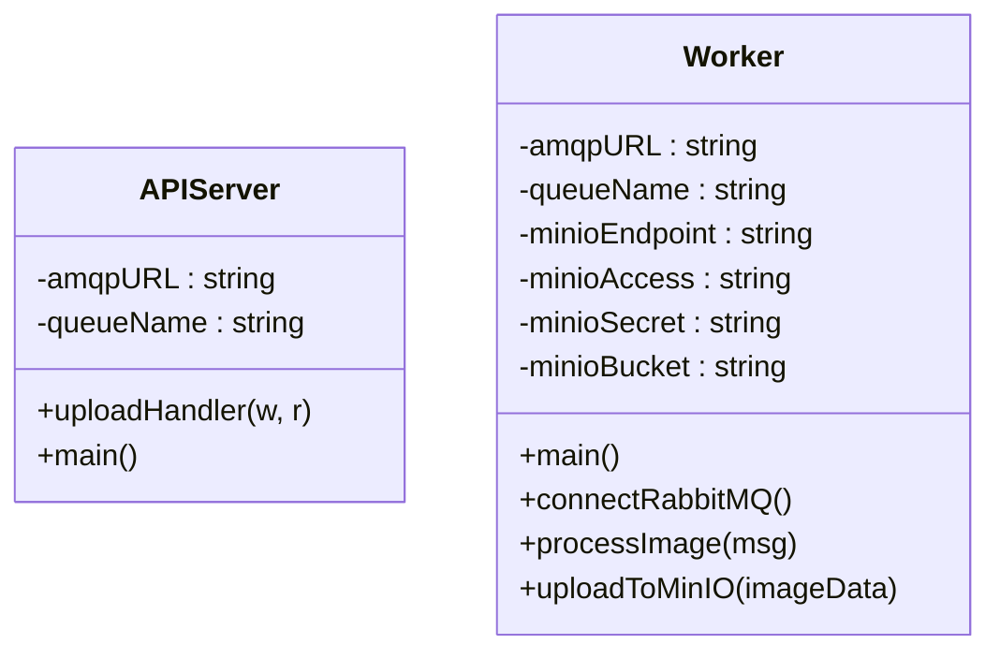
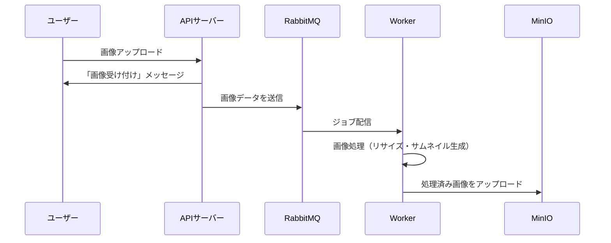

# 仕様

## 1. システム概要

本システムは、ユーザーがブラウザから画像をアップロードすると、バックグラウンドで画像のリサイズ、サムネイル生成などの処理を実施し、結果画像をオブジェクトストレージ（MinIO）に保存するサービスです。  
各コンポーネントはマイクロサービスとして分離され、RabbitMQ を用いて非同期に連携することで、Kubernetes の自動スケーリングや自己修復機能を活かした運用が可能です。

---

### 1. アーキテクチャ図（Mermaid 記法）



処理の流れ

---

### 2. クラス仕様図（Mermaid 記法）



APIサーバーと Worker の主なメソッドとフィールド

---

### 3. 処理フロー図（Mermaid 記法）



一連の流れ(シーケンス図)
---

<!-- Merkdown 内に記述した Mermaid コードをレンダリングできます。  
- **オンラインエディタ**: [Mermaid Live Editor](https://mermaid.live/)  -->
<!-- 
## 2. アーキテクチャ図

```plaintext
         +---------------+
         |   ブラウザ    |
         | (ユーザーUI)  |
         +-------+-------+
                 |
                 | HTTP (画像アップロード)
                 v
         +-------+-------+
         |  APIサーバー  |
         |  (Go, net/http)|
         +-------+-------+
                 |
                 | RabbitMQ クライアント
                 v
         +-------+-------+
         |   RabbitMQ    |
         | (ジョブキュー) |
         +-------+-------+
                 |
                 | RabbitMQ Consumer
                 v
         +-------+-------+
         |   Worker      |
         | (Go, imaging, |
         |  minio-go/v7) |
         +-------+-------+
                 |
                 | MinIO Client
                 v
         +---------------+
         |    MinIO      |
         | (オブジェクト |
         |  ストレージ)  |
         +---------------+
```

- **ブラウザ:** ユーザーが画像をアップロードするインターフェース（HTMLフォーム）。
- **APIサーバー:** アップロードされた画像を受信し、RabbitMQ のキューへジョブを送信。
- **RabbitMQ:** 画像処理タスクのキューイングを担当。
- **Worker:** RabbitMQ からジョブを受け取り、画像処理を実行。処理済み画像を MinIO にアップロード。
- **MinIO:** 処理済み画像を保存するオブジェクトストレージ。Webコンソールで管理可能。

---

## 3. クラス仕様図

### APIサーバー

```
┌─────────────────────────────┐
│          main.go            │
├─────────────────────────────┤
│ - amqpURL: string           │
│ - queueName: string         │
├─────────────────────────────┤
│ + uploadHandler(w, r)       │  ← HTTPハンドラー（画像アップロード受付）
│ + main()                    │  ← サーバー起動、静的ファイル提供
└─────────────────────────────┘
```

- **uploadHandler**  
  - 画像ファイルを受信し、RabbitMQ に接続して画像データ（バイナリ）とファイル名（ヘッダー）をメッセージとして送信。

### Worker

```
┌─────────────────────────────┐
│          main.go            │
├─────────────────────────────┤
│ - amqpURL: string           │
│ - queueName: string         │
│ - minioEndpoint: string     │
│ - minioAccess: string       │
│ - minioSecret: string       │
│ - minioBucket: string       │
├─────────────────────────────┤
│ + connectRabbitMQ()         │  ← RabbitMQへの接続（リトライ含む）
│ + processImage(msg)         │  ← 画像のデコード、リサイズ、サムネイル生成
│ + uploadToMinIO(imageData)  │  ← MinIOへのアップロード
│ + main()                    │  ← RabbitMQからメッセージ受信し処理実行
└─────────────────────────────┘
```

- **processImage**  
  - `github.com/disintegration/imaging` ライブラリを利用して画像をリサイズ・サムネイル生成。
- **uploadToMinIO**  
  - `github.com/minio/minio-go/v7` を使い、処理済み画像を `processed-images` バケットにアップロード。

---

## 4. 処理フロー

1. **ユーザーアップロード**  
   - ユーザーはブラウザで画像アップロードフォーム（APIサーバー提供）にアクセスし、画像を選択して送信する。

2. **APIサーバー処理**  
   - 画像ファイルを受信後、HTTPレスポンスとして「画像を受け付けました。処理を開始します。」を返す。  
   - 同時に、RabbitMQ のジョブキューに画像データとメタ情報（ファイル名など）を送信する。

3. **RabbitMQ 経由のジョブ伝達**  
   - APIサーバーから送信されたジョブは、RabbitMQ にキューイングされる。

4. **Worker による画像処理**  
   - Worker は RabbitMQ からジョブを取得し、画像データを読み込み、以下の処理を実施する：
     - 画像のデコード
     - リサイズ処理（例: 幅800ピクセルにリサイズ）
     - サムネイル生成（例: 200×200 ピクセル）
     - JPEG形式へのエンコード
     
5. **MinIO へのアップロード**  
   - Worker は処理済み画像を、MinIO クライアントを使って `processed-images` バケットにアップロードする。  
   - バケットが存在しない場合は、自動的に作成するロジックを実装（※本来は自動作成されるが、環境により作成されない場合はログやエラーチェックを実施）。

6. **結果確認**  
   - ユーザーは直接結果を確認するための機能は現状未実装。  
   - 処理済み画像は、MinIO の Web コンソールや MinIO Client を通じて確認可能。  
   - 今後は API サーバーに画像一覧表示（ギャラリー）機能を追加することで、ユーザーがブラウザ上で結果を閲覧できるよう拡張可能。 -->

---

## 5. 使用言語・フレームワーク等

- **プログラミング言語:**
  - Go (Golang) 1.23.0 以上

- **フレームワーク／ライブラリ:**  
  - APIサーバー: `net/http`（標準ライブラリ）  
  - RabbitMQ クライアント: `github.com/streadway/amqp`  
  - 画像処理: `github.com/disintegration/imaging`  
  - MinIO クライアント: `github.com/minio/minio-go/v7`

- **インフラ／運用:**  
  - コンテナ化: Docker  
  - ローカル実行: Docker Compose  
  - 本番環境: Kubernetes を利用したオーケストレーション（自動スケーリング、自己修復、ローリングアップデート）

- **その他ツール:**  
  - MinIO: オブジェクトストレージサービス（Webコンソールで管理・確認可能）  
  - RabbitMQ: メッセージブローカー（ジョブキュー管理用）

---

## 6. 補足

- **エラーハンドリングとリトライ:**  
  - Worker コンポーネントでは、RabbitMQ 接続に失敗した場合のリトライロジックを実装することで、起動タイミングのズレによる接続拒否を回避。

- **将来的な拡張:**  
  - APIサーバーに処理済み画像の一覧表示やギャラリー機能を実装し、ユーザーが結果を確認できるようにする。  
  - 署名付き URL の生成により、セキュアにオブジェクトストレージ内の画像へアクセス可能とする。

---
