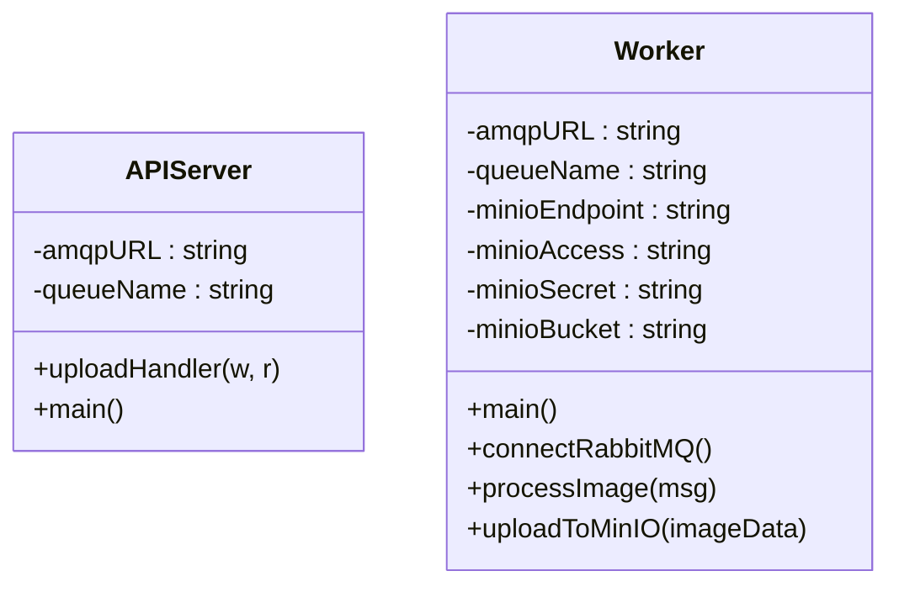
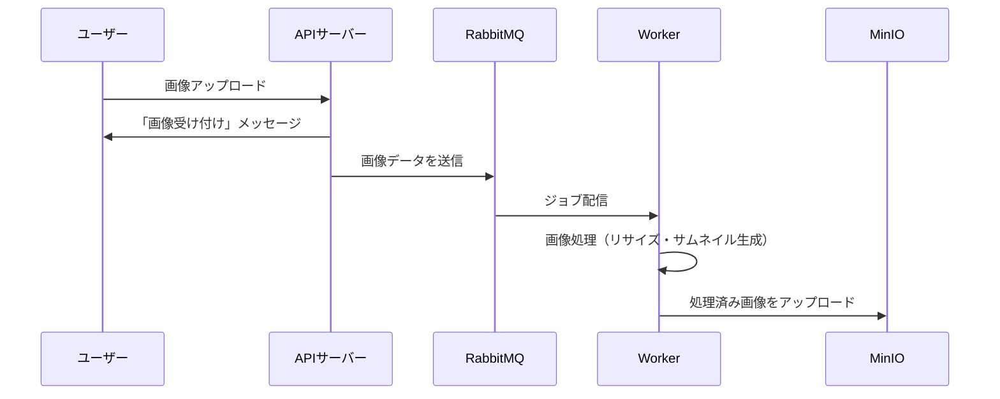

# Mermaid 


### 1. アーキテクチャ図（Mermaid 記法）

```mermaid
graph LR
    A[ブラウザ (ユーザーUI)] -->|画像アップロード| B[APIサーバー]
    B -->|ジョブ送信| C[RabbitMQ]
    C -->|ジョブ配信| D[Worker]
    D -->|画像処理・アップロード| E[MinIO]
```

処理の流れ

---

### 2. クラス仕様図（Mermaid 記法）



APIサーバーと Worker の主なメソッドとフィールド

---

### 3. 処理フロー図（Mermaid 記法）



一連の流れ(シーケンス図)
---

Merkdown 内に記述した Mermaid コードをレンダリングできます。  
- **オンラインエディタ**: [Mermaid Live Editor](https://mermaid.live/) 